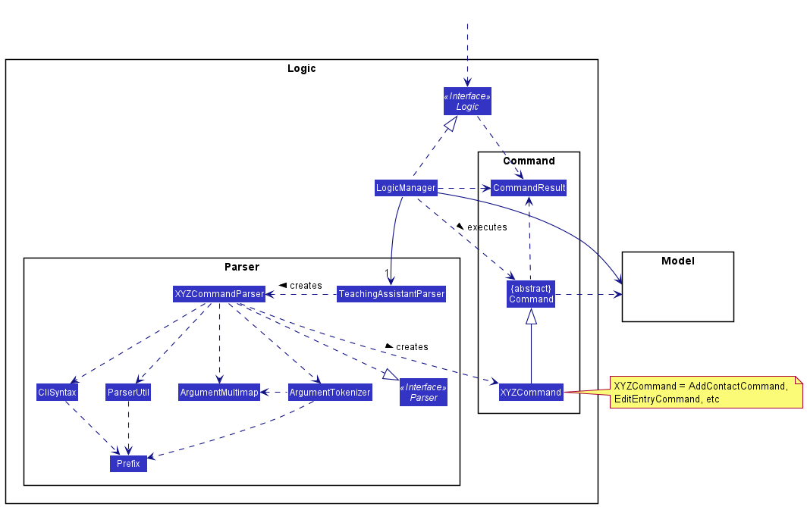
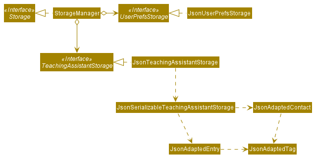
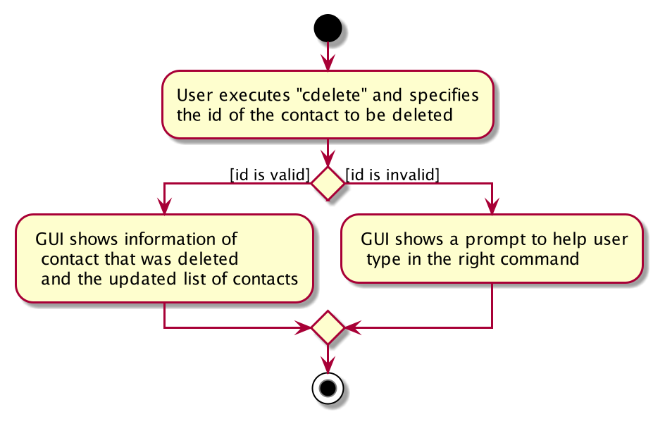
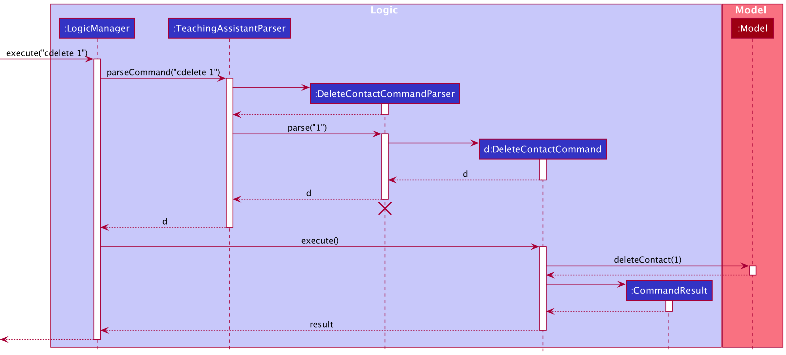
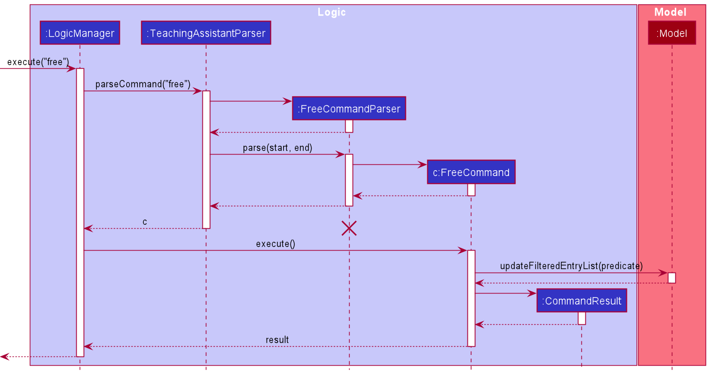
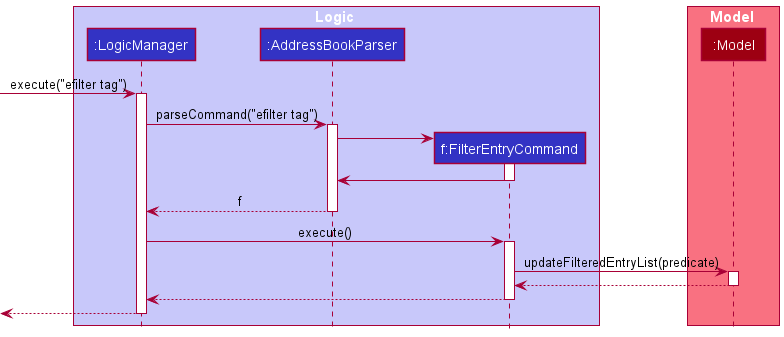
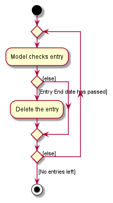

- [Getting Started](#getting-started)
- [Design and Architecture](#design)
  - [UI Component](#ui-component)
  - [Logic Component](#logic-component)
  - [Model Component](#model-component)
  - [Storage Component](#storage-component)
  - [Common Classes](#common-classes)
- [Implementation](#implementation)
  - [Deleting a contact in the address book](#deleting-a-contact-in-the-address-book)
  - [Enquire if time interval is free](#enquire-if-time-interval-is-free)
  - [Merge Schedule and Task](#merge-schedule-and-task)
  - [Filtering entries via tags](#filtering-entries-via-tags)
  - [List entry feature](#list-entry-feature)
  - [Clear overdue entry feature](#clear-overdue-entry-feature)
- [Appendix: Requirements](#appendix-requirements)
  - [Product Scope](#product-scope)
  - [User Stories](#user-stories)
  - [Use Cases](#use-cases)
  - [Non-Functional Requirements](#non-functional-requirements)
  - [Glossary](#glossary)
- [Appendix: Instructions for manual testing](#appendix-instructions-for-manual-testing)
  - [Adding a contact](#adding-a-contact)
  - [Finding contacts](#finding-contacts)
  - [Filtering contacts via tags](#filtering-contacts-via-tags)
  - [Editing a contact](#editing-a-contact)
  - [Deleting a contact](#deleting-a-contact)

--------------------------------------------------------------------------------------------------------------------

## **Getting Started**

Refer to the guide [_Setting up and getting started_](SettingUp.md).

--------------------------------------------------------------------------------------------------------------------

# Design

## Architecture

The ***Architecture Diagram*** given above explains the high-level design of the App. Given below is a quick overview of
each component.

**`Main`** has two classes
called [`Main`](https://github.com/AY2021S2-CS2103T-W13-4/tp/blob/master/src/main/java/seedu/address/Main.java)
and [`MainApp`](https://github.com/AY2021S2-CS2103T-W13-4/tp/blob/master/src/main/java/seedu/address/MainApp.java). It
is responsible for,

* At app launch: Initializes the components in the correct sequence, and connects them up with each other.
* At shut down: Shuts down the components and invokes cleanup methods where necessary.

[**`Commons`**](#common-classes) represents a collection of classes used by multiple other components.

The rest of the App consists of four components.

* [**`UI`**](#ui-component): The UI of the App.
* [**`Logic`**](#logic-component): The command executor.
* [**`Model`**](#model-component): Holds the data of the App in memory.
* [**`Storage`**](#storage-component): Reads data from, and writes data to, the hard disk.

Each of the four components,

* defines its *API* in an `interface` with the same name as the Component.
* exposes its functionality using a concrete `{Component Name}Manager` class (which implements the corresponding
  API `interface` mentioned in the previous point.

---

**How the architecture components interact with each other**

The ***Sequence Diagram*** below shows how the components interact with each other for the scenario where the user
issues the command `cdelete 1`.

The sections below give more details of each component.

---

### UI Component

**API** :
[`Ui.java`](https://github.com/AY2021S2-CS2103T-W13-4/tp/blob/master/src/main/java/seedu/address/ui/Ui.java)

The UI consists of a `MainWindow` that is made up of parts e.g.`CommandBox`, `ResultDisplay`, `ContactListPanel`
, `StatusBarFooter` etc. All these, including the `MainWindow`, inherit from the abstract `UiPart` class.

The `UI` component uses JavaFx UI framework. The layout of these UI parts are defined in matching `.fxml` files that are
in the `src/main/resources/view` folder. For example, the layout of
the [`MainWindow`](https://github.com/AY2021S2-CS2103T-W13-4/tp/blob/master/src/main/java/seedu/address/ui/MainWindow.java)
is specified
in [`MainWindow.fxml`](https://github.com/AY2021S2-CS2103T-W13-4/tp/blob/master/src/main/resources/view/MainWindow.fxml)

The `UI` component,

* Executes user commands using the `Logic` component.
* Listens for changes to `Model` data so that the UI can be updated with the modified data.

---

### Logic component

**API** :
[`Logic.java`](https://github.com/AY2021S2-CS2103T-W13-4/tp/blob/master/src/main/java/seedu/address/logic/Logic.java)

1. `Logic` uses the `TeachingAssistantParser` class to parse the user command.
1. This results in a `Command` object which is executed by the `LogicManager`.
1. The command execution can affect the `Model` (e.g. adding a person).
1. The result of the command execution is encapsulated as a `CommandResult` object which is passed back to the `Ui`.
1. In addition, the `CommandResult` object can also instruct the `Ui` to perform certain actions, such as displaying
   help to the user.

Given below is the Sequence Diagram for interactions within the `Logic` component for the `execute("cdelete 1")` API
call.

---

### Model component

**
API** : [`Model.java`](https://github.com/AY2021S2-CS2103T-W13-4/tp/blob/master/src/main/java/seedu/address/model/Model.java)

The `Model`,

* stores a `UserPref` object that represents the user’s preferences.
* stores Teaching Assistant data.
* exposes an unmodifiable `ObservableList<Contact>` and `ObservableList<Entry>` that can be 'observed' e.g. the UI can
  be bound to this list so that the UI automatically updates when the data in the list change.
* does not depend on any of the other components.

---

### Storage component

**
API** : [`Storage.java`](https://github.com/AY2021S2-CS2103T-W13-4/tp/blob/master/src/main/java/seedu/address/storage/Storage.java)

The `Storage` component,

* can save `UserPref` objects in json format and read it back.
* can save Teaching Assistant data in json format and read it back.

---

### Common Classes

Classes used by multiple components are in the `seedu.ta.commons` package.

---

# Implementation

This section describes some noteworthy details on how certain features are implemented.

### Deleting a contact in the address book

The command immediately responsible for this is the 'DeleteContactCommand'

An outline of the implementation is as follows:

The `TeachingAssistantParser` should accept the command word `cdelete`. It will then get
the `DeleteContactCommandParser`
to parse and return the `DeleteContactCommand`. Subsequently, it returns `CommandResult` which is shown on the command
result field of the GUI as the information of the user that is deleted.

The following activity diagram summarizes what happens when a user executes the cdelete command:

The following sequence diagram summarizes what happens when a user executes the cdelete command:

### Enquire if time interval is free

The free command mechanism provides users a quick way to find out if certain time intervals are available.

An outline of the proposed implementation is as follows:

The `TeachingAssistantParser` should accept another case of command word `free` which eventually returns `FreeCommand`
back to Logic Manager.

This command is then executed to return `CommandResult` which is either shown on the result display of the GUI as:

* "You're free!"
* Or "Sorry, you're not free. Entries occupying that time interval listed below!". The occupying entries are shown in
  the entry list at the main window.

The following activity diagram summarizes what happens when a user executes the new command:

The implementation of this command is similar to the List Command but requires a new predicate class to be created.
A `ListOccupyingEntryPredicate` class is implemented that provides a predicate that accepts user provided start and end
interval. The predicate is provided to `ModelManager#updateFilteredEntryList` and updates the entry list according to
the condition under `ListOccupyingEntryPredicate#test`.

The following sequence diagram outlines how the free operation works:

:information_source: **Note:** Details about creation of `ListOccupyingEntryPredicate`
has been omitted for simplicity.

### Merge Schedule and Task

The merger attempts to combine the functionalities of both the Task and Schedule classes. \
As the Task and Schedule classes are similar in features, we can merge them into an Entry class for maintainability.

Previously, we allowed schedules and tasks to be added separately through using two commands, `sadd` and `tadd`. \
Combining them into an Entry task, we implement an "eadd" command.

Below, we can see the before and after activity diagrams involving this merger.

**Before:** \

**After:** \

### Filtering entries via tags

Following the proposal above, there were no commands that utilise the tags attached to the objects. Hence, this proposal
aims to allow filtering these entries via their tags.

The Model class will be required to implement the `updateFilteredEntryList` which can incorporate
`updateFilteredTaskList` or `updateFilteredScheduleList` implemented in the previous two classes. This method will then
accept an argument of type `EntryTagContainsKeywordsPredicate`.

The following diagram omits the parser object created, namely `FilterEntryCommandParser` for simplicity.

**Design consideration**

1. Allow filtering by more than one tag.
1. Decide whether the filtering above considers Union or Intersection of tags.

### List entry feature

The list entry mechanism allows users to see all of their entries, or see them by day or by week.

An outline of the proposed implementation is as follows:

The `TeachingAssistantParser` should accept command word `elist` and eventually return a `ListEntryCommand`
back to `LogicManager`. This command can take in one of these three arguments: an empty string, the string “day” or the
string “week”. The arguments will be parsed by the `ListEntryCommandParser` to determine the behaviour of
`ListEntryFormatPredicate`. Then, `updateFilteredEntryList` method in the `Model` interface is called, passing in the
`ListEntryFormatPredicate` as an argument.

The following activity diagram (Fig 2.3.1) summarizes what happens when a user executes the list entry command.

Fig 2.3.1

The following sequence diagram (Fig 2.3.2) shows how the list entry operation works:

Fig 2.3.2

### Clear overdue entry feature

Clear overdue entry feature allows users to quickly discard entries that are no longer relevant. i.e. entries with end
dates that have passed.

An outline of the implementation is as follows:

The `TeachingAssistantParser` should accept another case of command word `eclear` which eventually returns a
`ClearOverdueEntryCommand` back to `LogicManager`. This command has no arguments and will immediately call
`clearOverdueEntries` method in `Model` interface. Finally, a new `CommandResult` is created to handle the result of
this command.

The following sequence diagram (Fig 2.3.3) shows how clear overdue entry command works:

Fig 2.3.3

The following activity diagram (Fig 2.3.4) shows how `Model` executes `clearOverdueEntries`:

---

# Documentation, logging, testing, configuration, dev-ops

* [Documentation guide](Documentation.md)
* [Testing guide](Testing.md)
* [Logging guide](Logging.md)
* [Configuration guide](Configuration.md)
* [DevOps guide](DevOps.md)

---

# Appendix: Requirements

## Product Scope

**Target user profile**:

* Are JC/Secondary school teachers
* Do not have their schedules and students' contacts digitalised
* Prefer to use typing over mouse/voice commands

**Value proposition**: efficient tool to keep track of schedules (i.e. entries) as well as find and add student contact
information easily

---

## User Stories

### Contacts

Priority | As a... | I want to... | So that I can...
--- | --- | --- | ---
high | teacher | add a contact | have a consolidated list of contacts that I require
high | teacher | delete a contact | remove a contact I no longer need
medium | teacher | edit a contact | modify contact details without going through the tedious process of removing and re-adding the contact
high | teacher | find a contact based on name | quickly find the details of a specific contact I need
high | teacher | list all contacts | keep track of the contacts of all the people I have saved
medium | teacher | filter contacts via tags | categorise and find a group of contacts easily

### Entries

Priority | As a... | I want to... | So that I can...
--- | --- | --- | ---
high | teacher | add an entry | have a consolidated list of entries representing my schedule
high | teacher | delete an entry | remove entries that have been cancelled
medium | teacher | edit an entry | modify entry details without going through the tedious process of removing and re-adding the entry; in case an entry has been rescheduled
high | teacher | list my entries according to day/week | view my entries in a more organised way
high | teacher | find an entry based on name | see the details of an entry I have saved
low | teacher | view all entries in my schedule for a specific time period | check if I am free during that timing
medium | teacher | filter entries via tags | categorise and find entries easily
medium | teacher | clear all entries that have passed | easily see ongoing or future entries without past entries cluttering the list

### Others

Priority | As a... | I want to... | So that I can...
--------- | --------- | -------------- | -----------------
high | forgetful teacher | be prompted for the User Guide | refer to it and type all commands without memorising their syntax
low | first time user | clear all my contacts and entries from teaching assistant | clear all sample data easily

---

## Use Cases

(For all use cases below, the **System** is the `Teaching Assistant` and the **Actor** is the `user`, unless specified
otherwise)

### Use case: UC01 - Add a contact

**MSS**

1. User requests to add a contact
2. Teaching Assistant adds the contact into the list

   Use case ends.

**Extensions**

* 2a. The given field(s) are invalid.

    * 2a1. Teaching Assistant shows an error message

      Use case ends.

* 2b. The contact to be added already exists in Teaching Assistant.

    * 2b1. Teaching Assistant shows an error message.

      Use case ends.

 

### Use case: UC02 - Delete an Entry

**MSS**

1. User requests to list entries **(UC03)**
2. Teaching Assistant shows a list of entries
3. User requests to delete a specific entry in the list
4. Teaching Assistant deletes the specified entry

   Use case ends.

**Extensions**

* 2a. The list of entries is empty.

  Use case ends.

* 3a. The given index is invalid
    * 3a1. Teaching Assistant shows an error message.

      Use case ends.

 

### Use case: UC03 - List entries

**MSS**

1. User requests to list entries.
2. Teaching Assistant shows a list of entries.

   Use case ends.

**Extensions**

* 1a. User requests to list entries that occurs today.

    * 1a1. Teaching Assistant shows a list of entries that happen today.

      Use case ends.

* 1b. User requests to list entries that occurs this week.

    * 1b1. Teaching Assistant shows a list of entries that occurs this week

      Use case ends.

* 1c. The given parameter is invalid.

    * 1c1. Teaching Assistant shows an error message.

      Use case ends.

 

### Use case: UC04 - Check if user is free on a given timeslot

**MSS**

1. User requests to if he/she is free on a given timeslot.
2. Teaching Assistant replies that the user is free.

   Use case ends.

* 1a. The given timeslot is invalid.

    * 1a1. Teaching Assistant shows an error message.

      Use case ends

* 1b. The user is not free on the given timeslot.

    * 1b1. Teaching Assistant replies that the user is not free.

    * 1b2. Teaching Assistant shows a list of entries that coincide with the given timeslot.

      Use case ends

### Use case: UC05 - Find a contact

**MSS**

1. User requests to find a contact with specified keyword(s)
2. Teaching Assistant replies to the user contacts that matches the keyword(s)

   Use case ends.

* 1a. The given keyword(s) are invalid

    * 1a1. Teaching Assistant shows an error message.

      Use case ends

* 2a. No contact matches the specified keyword(s).

    * 2a1. Teaching Assistant shows an empty list.

      Use case ends

---

## Non-Functional Requirements

1. Should work on any mainstream OS as long as it has Java 11 or above installed.
2. A user with above average typing speed for regular English text (i.e. not code, not system admin commands) should be
   able to accomplish most of the tasks faster using commands than using the mouse.
3. The system should be usable by a novice who has never used virtual management applications.
4. The user interface should be intuitive enough for users who are not IT-savvy.
5. The product is offered as an open source software.

---

## Glossary

### JC

Junior College (JC) is the post-secondary education level where students are preparing for university. JC is also the
high-school equivalent in other countries. Hence, JC teachers may be packed with consultation schedules which can
leverage our software.

### Mainstream OS

Mainstream operating systems are the current operating systems with a significant market share, namely Windows, Linux,
Unix, and OS-X.

### MSS

Main Success Scenario (MSS) defines the optimal outcome of our commands, i.e. in the case where no errors occurred.

---

# Appendix: Instructions for manual testing

### Adding an entry

1. Adding an entry while all entries are being shown.
    1. Prerequisites: The entry should not already exist in the entry list and the new entry's start and end datetime
       should not overlap with existing entries. List all entries using the `elist` command.
    1. Test case: `eadd n/Meeting sd/2021-12-12 13:00 ed/2021-12-12 14:00` 
       Expected: The entry is added to the entry list. Success message with details of the added entry is shown in the
       result window.
    1. Test case: `eadd n/Meeting sd/2021-12-12 19:00 ed/2021-12-12 13:00` 
       Expected: The entry is not added. Error message is shown in the result display indicating that start datetime has
       to be before end datetime.

### Finding an entry

1. Finding an entry while all entries are being shown.
    1. Prerequisites: There should be entries present in the entry list. List all entries using the `elist` command.
    1. Test case: `efind Meeting` 
       Expected: Assuming that there is an entry named "Meeting", a message indicating how many entries are listed is
       shown in the result window. Entry list will only list the entry with the matching name.
    1. Test case: `efind Random` 
       Expected: Assuming that there are no entries named Random, a message shown in the result display will indicate 0
       entries being listed. Entry list will be empty.

### Filtering tags

1. Filtering tags while all entries are being shown.
    1. Prerequisites: There should be entries with tags present. List all entries using the `elist` command.
    1. Test case: `efilter consultation` 
       Expected: Assuming there is only one entry that has the tag `consultation`, a message is shown in the result
       display indicating 1 entry is being listed. Entry list will only list the entry with the matching tag.
    1. Test case: `efilter CCA Tennis` 
       Expected: Assuming there is only one entry that has both tags `CCA` and `Tennis`, a message is shown in the
       result display indicating 1 entry is being listed. Entry list will only list the entry with the matching tags.

### Editing an entry

1. Editing an existing entry while all entries are being shown.
    1. Prerequisites: There should be entries present in the entry list. List all entries using the `elist` command.
    1. Test case: `eedit 1 p/97865534` 
       Expected: The entry that is numbered "1." is edited such that the previous phone number is now changed to the new
       one specified. Details of the edited entry is shown in the result display.
    1. Test case: `eedit 1` 
       Expected: No entry is edited. Error details shown in the result display indicating at least one field should be
       given.

### Listing entries

1. Listing entries while there are entries present and are not currently all listed.
    1. Prerequisites: There should be entries present in the entry list but not all of them are seen.
    1. Test case: `elist`  
       Expected: Success message indicating how many entries are listed is shown in the result display. All entries that
       are present are shown in the entry list.
    1. Test case: `elist day` 
       Expected: A message indicating how many entries are listed is shown in the result display. All entries that have
       the same date as the current date are shown in the entry list.
    1. Test case: `elist week` 
       Expected: A message indicating how many entries are listed is shown in the result display. All entries that have
       date 6 days from the current date or same date as current date are shown in the entry list.

### Checking if interval is free

1. Checking if an interval is free while there are entries present.
    1. Prerequisites: There should be entries present in the entry list. The start and end datetime field provided
       should fall within the datetime of at least one entry to test the "Not free" response.
    1. Test case: `free sd/2021-12-12 13:00 ed/2021-12-12 14:00` 
       Expected: Assuming there is only one entry that falls within this interval, message indicating the interval is
       not free is shown in the result display. Entry list will only list the entry that occupies the interval.
    1. Test case: `free sd/2021-11-13 13:00 ed/2021-11-13 14:00` 
       Expected: Assuming there are no entries that falls within this interval, message indicating the interval is free
       is shown in the result display. Entry list will be empty.

### Deleting entries

1. Deleting an entry while all entries are being shown.
    1. Prerequisites: List all entries using the `elist` command. Multiple entries in the list.
    1. Test case: `edelete 0`  
       Expected: No entry is deleted. Error details shown in the result display. Entry list remains the same.
    1. Test case: `edelete 1`  
       Expected: The entry that is numbered "1." is deleted from the entry list. Details of the deleted entry is shown
       in the result display.

### Clearing overdue entries

1. Clearing overdue entries while there are overdue entries present.
    1. Prerequisites: There should be overdue entries (shown as a red entry box) in the entry list.
    1. Test case: `eclear` 
       Expected: Success message is shown. All entries that are before current date and time should be deleted.

### Adding a contact

1. Adding a contact while all contacts are being shown.
    1. Prerequisites: The contact should not already exist in the list. List all contacts using the `clist` command.
    1. Test case: `cadd n/Danny Tan p/98765432 e/danny@email.com` 
       Expected: The contact is added into the contact list. Success message with details of the added contact is shown in the
       result window.
    1. Doing the exact same command one more time will fail with an error message as duplicated contacts are not allowed to be added into the list

### Finding contacts

1. Finding contacts while all contacts are being shown
    1. Prerequisites: There should be at least a contact present in the contact list. List all contacts using the `clist` command.
    1. Test case: `cfind Danny` 
       Expected: Assuming that there is at least a contact named "Danny", a message indicating how many contacts are listed is
       shown in the result window. Contact list will only list the contacts with the matching name.
    1. Test case: `cfind Random` 
       Expected: Assuming that there are no contacts named "Random", a message shown in the result display will indicate 0
       contacts being listed. Contact list will be empty.

### Filtering contacts via tags

1. Filtering tags while all contacts are being shown.
    1. Prerequisites: There should be contacts with tags present. List all contacts using the `clist` command.
    1. Test case: `cfilter friend` 
       Expected: Assuming there is only one contact that has the tag `friend`, a message is shown in the result
       display indicating 1 contact is being listed. Contact list will only list the contact with the matching tag.
    1. Test case: `cfilter family important` 
       Expected: Assuming there is only one contact that has both the tags `family` and `important`, a message is shown in the
       result display indicating 1 contact is being listed. Contact list will only list the contact with the matching tags.

### Editing a contact

1. Editing an existing contact while all contacts are being shown.
    1. Prerequisites: There should be contacts present in the contact list. List all contacts using the `clist` command.
    1. Test case: `cedit 1 n/Amy Toh` 
       Expected: The contact that is numbered "1." is edited such that the previous name is now changed to the new
       one specified. Details of the edited contact is shown in the result display.
    1. Test case: `cedit 1 n/Amy Toh p/98761234` 
       Expected: The contact that is numbered "1." is edited such that the previous name and phone number 
       are now changed to the new ones specified. Details of the edited contact is shown in the result display.
    1. Test case: `cedit 1` 
       Expected: No contact will be edited. Error details shown in the result display indicating at least one field should be 
       given.

### Deleting a contact

1. Deleting a contact while all contacts are being shown.
    1. Prerequisites: List all contacts using the `clist` command. Contact list must not be empty.
    1. Test case: `cdelete 0`  
       Expected: No contact is deleted. Error details regarding the invalid argument will be 
       shown in the result display. Contact list remains the same.
    1. Test case: `cdelete 1`  
       Expected: The contact that is numbered "1." is deleted from the contact list. Details of the deleted contact is shown 
       in the result display.
