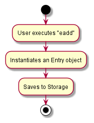
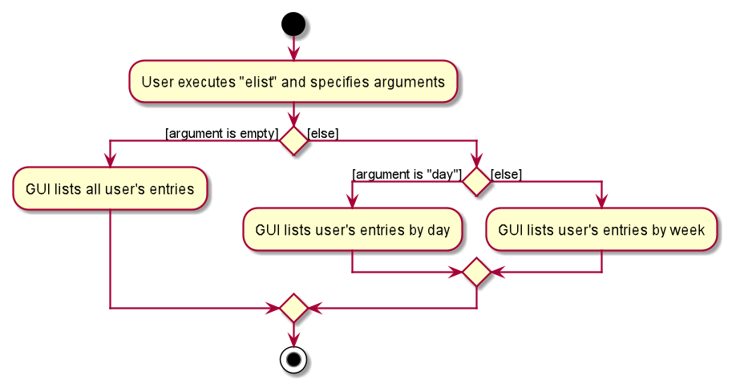
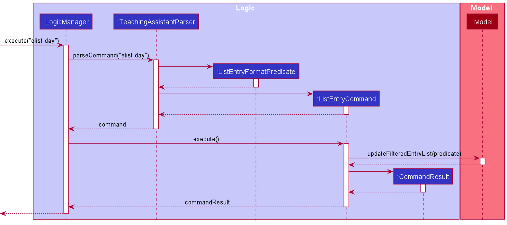

# Implementation
This section describes some noteworthy details on how certain features are implemented.

### [Proposed] Enquire if time interval is free

The proposed enquiry mechanism provides users a quick way to find out if certain time intervals are available.

An outline of the proposed implementation is as follows:

The `AddressBookParser` should accept another case of command word `free` which eventually returns `CheckFreeCommand`
back to Logic Manager.

This command is then executed to return `CommandResult` which is either shown on the command result field of the GUI as:
* "Free"
* Or the task that is occupying that time interval

The following activity diagram summarizes what happens when a user executes the new command:

The `ModelManager` class will be required to implement `checkIfFree` method which eventually checks the interval
provided by the user against all tasks' `LocalDateTime` attribute in
`UniqueTaskList#checkIfFree(start, end)`.

The following sequence diagram outlines how the enquiry operation works:

Note: Details in Model class and `CheckFreeCommandParser` have been omitted for simplicity.

### [Proposed] Merge Schedule and Task
The proposed merger attempts to combine the functionalities of both the Task and Schedule classes. \
As the Task and Schedule classes are similar in features, we can merge them into an Entry class for maintainability.

Previously, we allowed schedules and tasks to be added separately through using two commands, `sadd` and `tadd`. \
Combining them into an Entry task, we propose a "eadd" command.

Below, we can see the before and after activity diagrams involving this merger.

**Before:** \

**After:** \

### [Proposed] Filtering entries via tags
Following the proposal above, there were no commands that utilise the tags attached to the objects. Hence,
this proposal aims to allow filtering these entries via their tags.

The Model class will be required to implement the `updateFilteredEntryList` which can incorporate
`updateFilteredTaskList` or `updateFilteredScheduleList` implemented in the previous two classes. This method will
then accept an argument of type `EntryTagContainsKeywordsPredicate`.

The following diagram omits the parser object created, namely `FilterEntryCommandParser` for simplicity.

**Design consideration**
1. Allow filtering by more than one tag.
1. Decide whether the filtering above considers Union or Intersection of tags.

### List entry feature
The proposed list entry mechanism allows users to see all of their schedules, or see them by day or by week.

An outline of the implementation is as follows:

The `TeachingAssistantParser` should accept command word `elist` and eventually returns a `ListEntryCommand` 
back to `LogicManager`. This command can take in three arguments: an empty string, the string “day” or the string “week”. 
The arguments will be parsed by the `ListEntryCommandParser` to determine the behaviour of `ListEntryFormatPredicate`.
Then, `updateFilteredEntryList` method in the `Model` interface is called, passing in the `ListEntryFormatPredicate` as 
an argument.

The following activity diagram (Fig 2.3.1) summarizes what happens when a user executes the list entry command. The
`ListEntryCommandParser` is not featured for simplicity.

Fig 2.3.1

The following sequence diagram (Fig 2.3.2) shows how the list entry operation works:

Fig 2.3.2

---

# Documentation, logging, testing, configuration, dev-ops
* [Documentation guide](Documentation.md)
* [Testing guide](Testing.md)
* [Logging guide](Logging.md)
* [Configuration guide](Configuration.md)
* [DevOps guide](DevOps.md)

---

# Appendix: Requirements

## Product Scope

**Target user profile**:

* Are JC/Secondary school teachers
* Do not have their schedules and students' contacts digitalised
* Prefer to use typing over mouse/voice commands

**Value proposition**: efficient tool to keep track of schedules and tasks as well as find and add student contact
information easily.

---

## User Stories

### Contacts

Priority | As a... | I want to... | So that I can...
--- | --- | --- | ---
high | teacher | add a contact | have a consolidated list of contacts that I require
high | teacher | delete a contact | remove a contact I no longer need
medium | teacher | edit a contact | modify contact details without going through the tedious process of removing and re-adding the contact
high | teacher | find a contact based on name | quickly find the details of a specific contact I need
high | teacher | list all contacts | keep track of the contacts of all the people I have saved
medium | teacher | filter contacts via tags | categorise and find a group of contacts easily

### Entries

Priority | As a... | I want to... | So that I can...
--- | --- | --- | ---
high | teacher | add an entry | have a consolidated list of entries representing my schedule
high | teacher | delete an entry | remove entries that have been cancelled
medium | teacher | edit an entry | modify entry details without going through the tedious process of removing and re-adding the entry; in case an entry has been rescheduled
high | teacher | list my entries according to day/week | view my entries in a more organised way
high | teacher | find an entry based on name | see the details of an entry I have saved
low | teacher | view all entries in my schedule for a specific time period | check if I am free during that timing
medium | teacher | filter entries via tags | categorise and find entries easily
medium | teacher | clear all entries that have passed | easily see ongoing or future entries without past entries cluttering the list

### Others

Priority | As a... | I want to... | So that I can...
--------- | --------- | -------------- | -----------------
high | forgetful teacher | be prompted for the User Guide | refer to it and type all commands without memorising their syntax
low | first time user | clear all my contacts and entries from teaching assistant | clear all sample data easily

---

## Use Cases

### Use case: Delete a contact

**MSS**

1. User requests to list all contacts.
2. Teaching Assistant shows a list of all contacts.
3. User requests to delete a specific contact in this list.
4. Teaching Assistant deletes the contact.

   Use case ends.

**Extensions**

* 2a. The list is empty.

  Use case ends.

* 3a. The given index is empty.

    * 3a1. Teaching Assistant shows an error message.

      Use case resumes at step 2.

 

### Use case: Add a schedule

**MSS**

1. User requests to add a schedule.
2. AddressBook adds the schedule into the list.

   Use case ends.

**Extensions**

* 2a. The given date(s) are invalid.

    * 2a1. Teaching Assistant shows an error message.

      Use case ends.

 

### Use case: Delete a schedule

**MSS**

1. User request to list schedules.
2. Teaching Assistant shows a list of schedules.
3. User requests to delete a specific schedule in the list.
4. Teaching Assistant deletes the schedule.

   Use case ends.

**Extensions**

* 2a. The list is empty.

  Use case ends.

* 3a. The given schedule name is invalid.

    * 3a1. Teaching Assistant shows an error message.

      Use case ends.

---

## Non-Functional Requirements

1. Should work on any mainstream OS as long as it has Java 11 or above installed.
2. A user with above average typing speed for regular English text (i.e. not code, not system admin commands) should be
   able to accomplish most of the tasks faster using commands than using the mouse.
3. The system should be usable by a novice who has never used virtual management applications.
4. The user interface should be intuitive enough for users who are not IT-savvy.
5. The product is offered as an open source software.

---

## Glossary

### JC
Junior College (JC) is the post-secondary education level where students are preparing for university.
JC is also the high-school equivalent in other countries. Hence, JC teachers may be packed with consultation
schedules which can leverage our software.

### Mainstream OS
Mainstream operating systems are the current operating systems with a significant market share, namely Windows, Linux,
Unix, and OS-X.

### MSS
Main Success Scenario (MSS) defines the optimal outcome of our commands, i.e. in the case where no errors occurred.

---

